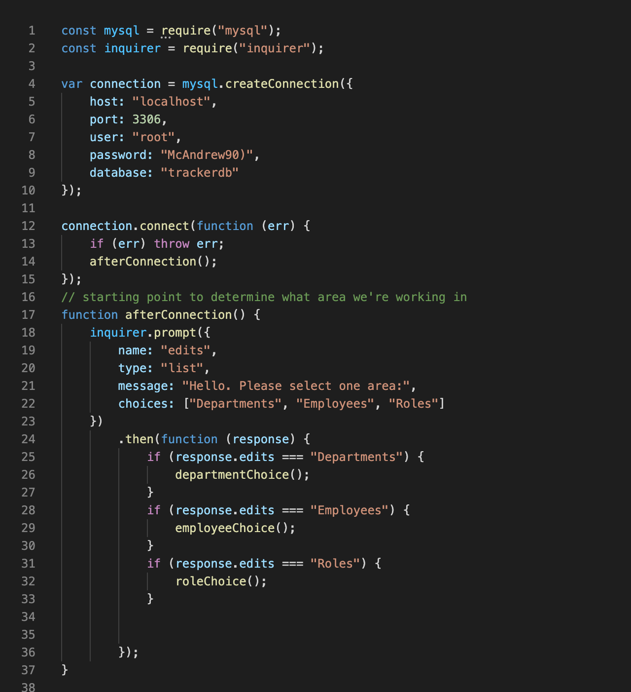
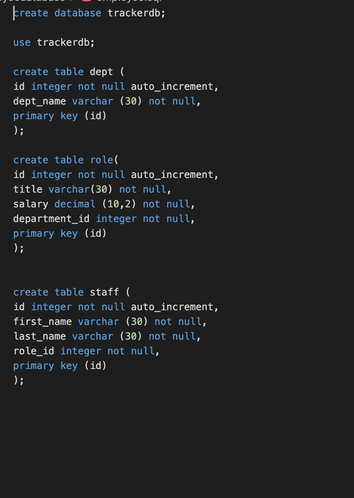
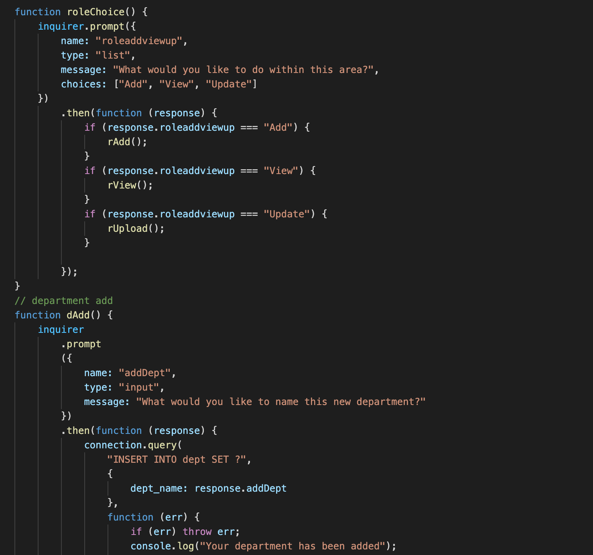
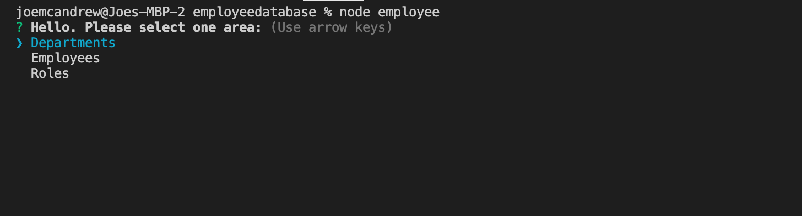
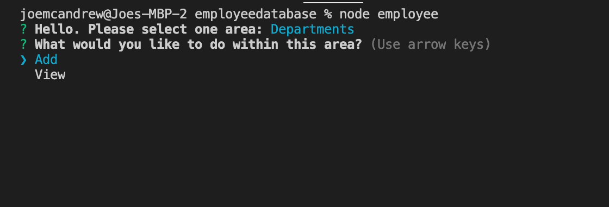

##                      *** Employee Tracker ***

Developers are often tasked with creating interfaces that make it easy for non-developers to view and interact with information stored in databases. Often these interfaces are known as **C**ontent **M**anagement **S**ystems. The following is a small creation in order to help a ficitional employer manage new and old employees at their establishment.

## Technologies Used
* Javascript
* Node.Js / Inquirer
* MYSQL

## Installation

-Must npm install inquirer and mysql
-Must create database with 3 tables in MySQL workbench
-Run within terminal

## Usage

-Run node employee.js to initialize 
-Select options generated from inquirer to naviagte to area where you would like to make edits within

## Contributors
-N/A

## Preview

